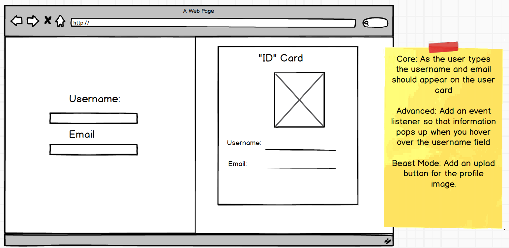
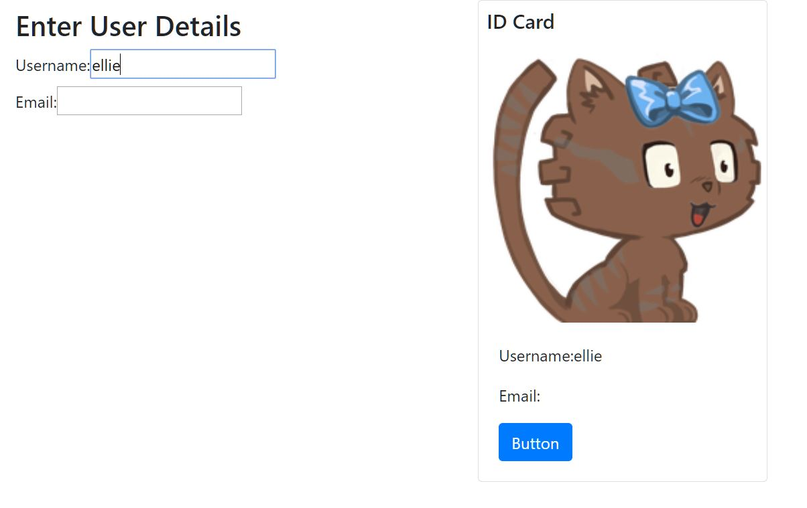

# React Practice - User ID Card

---

## Instruction

- Create a react app that will accept a username and email address.

### Wireframe:

### Core:

- As the user types the username and email should be displayed below an avatar picture on the right

### Advanced (Updated instruction - different from wireframe):

- Add extra event listeners to the form so that some extra information appears when a user starts to type etc

### Beast (Updated instruction - different from wireframe):

- Please refactor the above challenge to lift state so that the left and right components are two different components.

---

### Final product:

- Enjoy a random cat picture when entering your username :)

---

### Resources

- Cat pictures from: https://robohash.org/
